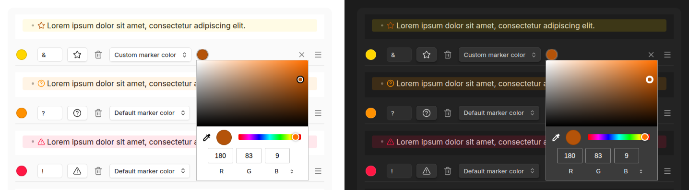
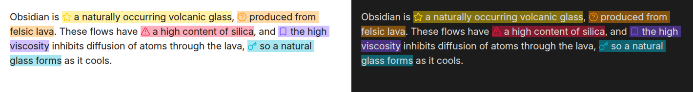
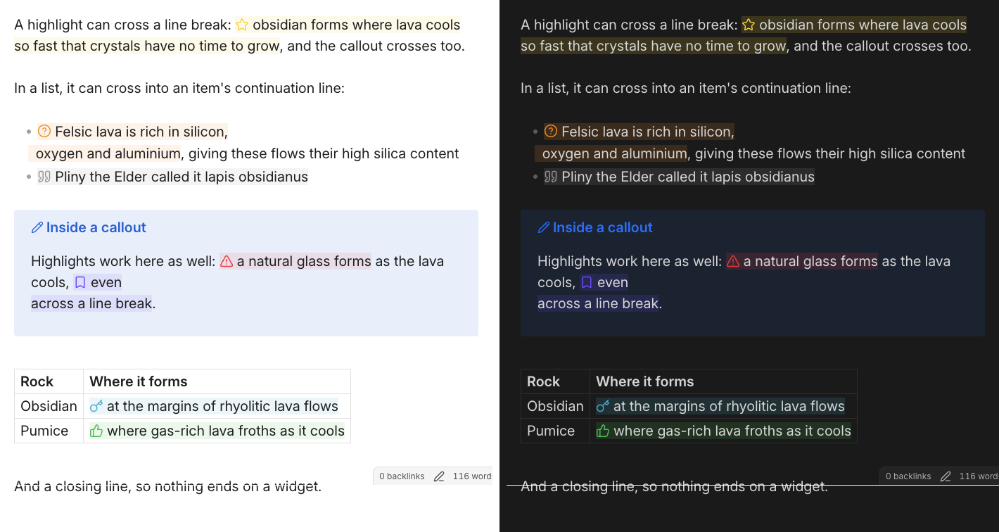
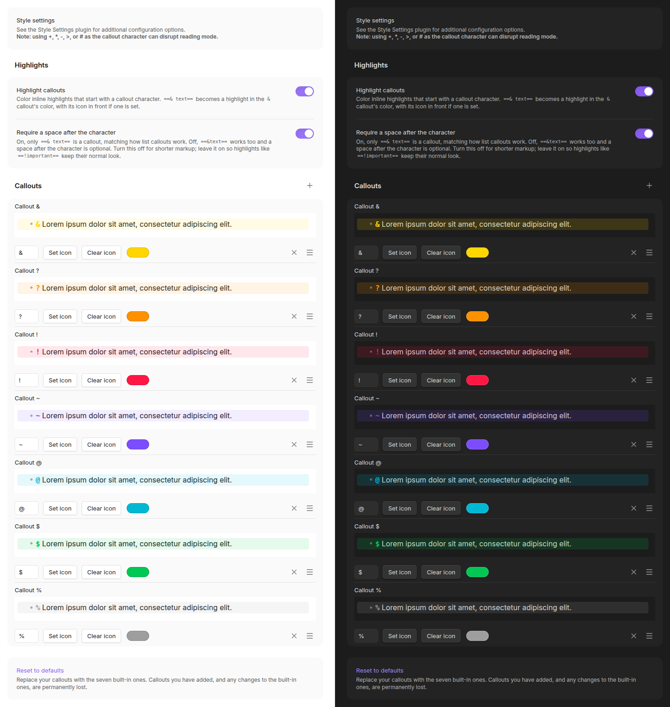
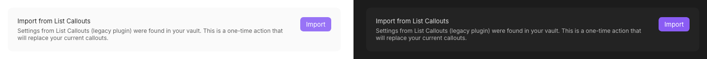

# List Callouts, Improved

Create customized callouts in any list or highlighted text in Obsidian.

> [!NOTE]
> **This project is a fork of [obsidian-list-callouts](https://github.com/mgmeyers/obsidian-list-callouts) by [@mgmeyers](https://github.com/mgmeyers)**, who deserves all the credit for the original plugin and its design. Unfortunately that project has seen no activity since [September 2024](https://github.com/mgmeyers/obsidian-list-callouts/releases/tag/1.2.9) and appears to be abandoned by the author.
>
> This fork picks up maintenance and feature development so the plugin keeps working with current versions of Obsidian.

Typing a configurable character at the beginning of a list item turns the item into a highlighted callout:

The characters can be replaced with icons:

Characters, icons, and colors are all configurable, and you can add your own callouts:

A callout's color paints both its marker and its background. If the marker is hard to read against a faint background, switch **Default marker color** to **Custom marker color** and pick a color for the marker alone. The background keeps the callout's color, and the marker color also applies to that callout's highlights:

Callout padding and background intensity can be adjusted with the Style Settings plugin.

## Highlights

The same callout triggers work inside Obsidian's `==highlight==` syntax. Start a highlight with a callout trigger and a space `==* Highlighted text==`, and it takes that callout's color and icon:

A highlight that runs across a line break is colored as one in both the editor and reading view, including a list item's continuation line. Highlights inside callout blocks and tables work too:

## Managing callouts

Callouts are defined in one list. A new vault starts with the seven shown above, and any of them can be edited, reordered by dragging, or deleted, built-in ones included.

**Reset to defaults**, at the bottom of the settings tab, restores the original seven. It replaces everything currently configured, so added callouts and edits to the built-in ones are lost. It asks for confirmation first and can't be undone.

The order matters: it is the order the cycling commands below step through.

## Commands

Each command can be given a hotkey from Settings → Hotkeys. All three act on every line a selection touches, skipping lines that aren't list items, and one undo reverts them all.

| Command | What it does |
| --- | --- |
| Next callout / Previous callout | Steps the line through the callout list in the order the settings tab shows. A plain list item is part of the cycle: stepping off either end leaves a plain list item, so overshooting wraps around instead of stranding the line, and the two directions are exact inverses. |
| Remove callout | Strips the callout character from the current line, leaving the list item behind. |

## Support for custom icons

Any SVG in your vault's `.obsidian/icons` folder is registered as an icon and appears in the picker alongside the ones Obsidian ships. A file named `My Fancy Icon.svg` gets the icon name `my-fancy-icon`.

This is the same folder [Iconize](https://github.com/FlorianWoelki/obsidian-iconize) uses, so a vault already keeping icons there needs no changes.

Icons are read when the plugin loads, so restart Obsidian or toggle the plugin after adding files. A name that an Obsidian icon already uses is skipped rather than replaced, and a file that is not usable SVG is skipped with a note in the console.

## Migrating from [List Callouts](https://github.com/mgmeyers/obsidian-list-callouts)

This fork uses a new plugin id, so Obsidian treats it as a separate plugin and your existing List Callouts settings won't carry over on their own.

If the original plugin's settings are still in your vault, the settings tab offers an **Import from List Callouts** button that copies them over.

Once migrated, disable or delete the old plugin.

## Development

See [docs/DEVELOPMENT.md](docs/DEVELOPMENT.md) for building the plugin and [docs/TESTING.md](docs/TESTING.md) for running the test suite.

## License

[GPL-3.0](LICENSE.md)

If this plugin is useful to you, please consider [buying me a coffee](https://buymeacoffee.com/danyim).
