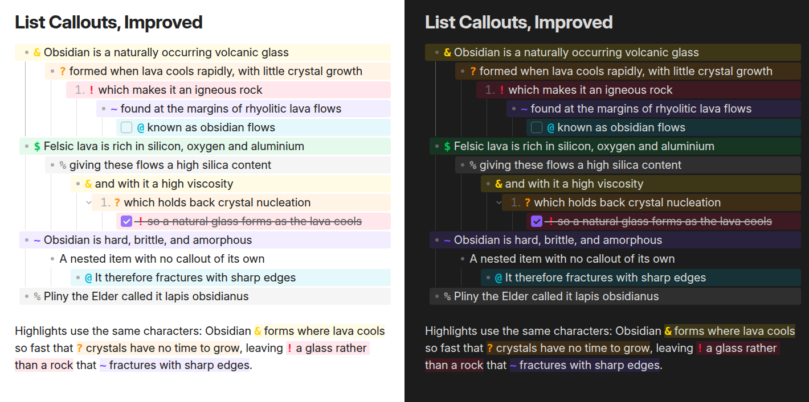
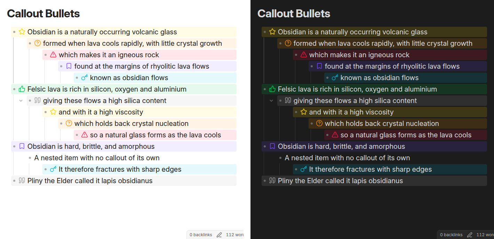
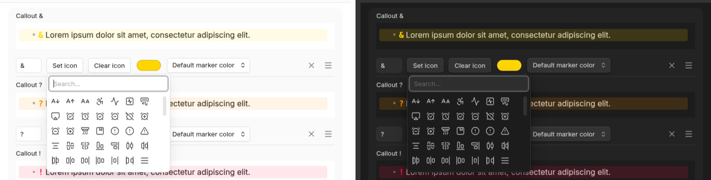

# Improved List Callouts

Create callouts in lists in Obsidian.

> **About this fork**
>
> Improved List Callouts is a fork of [obsidian-list-callouts](https://github.com/mgmeyers/obsidian-list-callouts)
> by [@mgmeyers](https://github.com/mgmeyers), who deserves all the credit for the original
> plugin and its design. That project has seen no releases or commits since
> [1.2.9](https://github.com/mgmeyers/obsidian-list-callouts/releases/tag/1.2.9)
> (September 2024) and appears to be abandoned, with issues and pull requests going unanswered.
>
> This fork picks up maintenance so the plugin keeps working with current versions of Obsidian.
> It remains licensed under the GPL-3.0, same as the original.

Typing a configurable character at the beginning of a list item will turn the item into a callout:



The characters can also be replaced with icons:



Characters, icons and colours are all configurable, and you can add your own callouts.
**Set icon** opens a searchable picker of every icon the running copy of Obsidian
knows about, so it stays current as Obsidian adds icons:



The padding of the callouts can be adjusted using the Style Settings plugin.

## Managing callouts

Callouts are one list. A new vault starts with the seven shown above, and from there
any of them can be edited, reordered by dragging, or deleted — the built-in ones
included. Nothing is fixed, so a vault can end up with a completely different set, or
with none at all.

**Reset to defaults**, at the bottom of the settings tab, puts the original seven
back. It replaces everything currently configured, so callouts you have added and
edits to the built-in ones are lost; it asks for confirmation first, and the change
can't be undone.

The order is worth caring about, because it's the order the cycling commands below
step through.

## Commands

Each of these takes a hotkey like any other command, from Settings → Hotkeys. All
three act on every line a selection touches — skipping lines that aren't list items —
and one undo puts them all back.

**Improved List Callouts: Next callout** and **Previous callout** step the line through
the callout list, in the order the settings tab shows. A plain list item is part of that
cycle rather than only its starting point: stepping off either end leaves a plain list
item, so tapping past the callout you wanted comes back round instead of stranding the
line, and the two directions are exact inverses.

**Improved List Callouts: Remove callout** strips the callout character from the line
the cursor is on, leaving the list item behind.

## Custom icons

Any SVG in your vault's `.obsidian/icons` folder is registered as an icon and appears
in the picker alongside the ones Obsidian ships. A file named `My Fancy Mark.svg`
becomes the icon `my-fancy-mark`.

That is the same folder [Iconize](https://github.com/FlorianWoelki/obsidian-iconize)
uses, so a vault already keeping icons there needs no changes.

Icons are read when the plugin loads, so restart Obsidian or toggle the plugin after
adding files. A name that an Obsidian icon already uses is skipped rather than
replacing it, and a file that is not usable SVG is skipped with a note in the console.

## Coming from List Callouts

Because this fork uses a new plugin id, Obsidian treats it as a separate plugin and
your existing List Callouts settings won't carry over on their own.

If the original plugin's settings are still in your vault, the settings tab offers an
**Import from List Callouts** button that copies them across, recoloured built-ins and
custom callouts alike. Importing replaces the current callouts, so it asks for
confirmation first. The button only appears when there's something to import.

You can leave the original plugin installed; the two don't share any state.

## Development

```bash
npm install
npm run dev     # rebuild on change
npm run build   # type-check and produce main.js
npm run lint
```

`npm run screenshots` regenerates the images above from a real Obsidian render, so
the README always shows what the current code actually produces. Each image is a
composite of the same view in light and dark mode. It writes into `screenshots/`,
needs a display like the tests do, and renders in Inter:

```bash
sudo apt-get install fonts-inter
```

The capture fails rather than falling back to another typeface, so the images stay
consistent between runs on different machines.

`npm run icons` regenerates `src/iconAliases.ts` from the `lucide-static` package.
That table only supplies *search aliases* for the icon picker. The icons themselves
come from whatever Obsidian registers at runtime, so the picker stays current even when
this file doesn't.

### Tests

End-to-end tests run against real Obsidian via
[wdio-obsidian-service](https://github.com/jesse-r-s-hines/wdio-obsidian-service),
which downloads and sandboxes its own copies of the app.

```bash
npm test
```

By default this runs against Obsidian 1.1.8 and `latest`, on both the desktop and
emulated-mobile UI. Override with:

```bash
OBSIDIAN_VERSIONS="latest/latest" npm test
```

The two versions matter: Obsidian 1.13 replaced the imperative settings API with
declarative setting definitions. The plugin implements both, so the older version
exercises the `display()` fallback and `latest` exercises `getSettingDefinitions()`.

1.1.8 rather than wdio's `earliest`, which resolves to the `minAppVersion` of 1.1.1:
Obsidian 1.1.1 through 1.1.7 were insiders-only releases with no public installer, so
downloading them needs Catalyst credentials. 1.1.8 is the oldest publicly available
build at or above the floor.

Each run writes a rendering of live preview and reading mode per Obsidian version and
platform into `test/screenshots/`. CI uploads them as build artifacts, so a version bump
that changes how callouts look is visible without reproducing it locally.

A scheduled workflow re-runs the suite whenever a new Obsidian version ships. To include
Obsidian beta builds, add `OBSIDIAN_EMAIL` and `OBSIDIAN_PASSWORD` repository secrets for
an Insiders account with 2FA disabled.

On Linux, Obsidian needs a display; CI uses Xvfb with a window manager, and locally you
can do the same:

```bash
xvfb-run -a npm test
```
